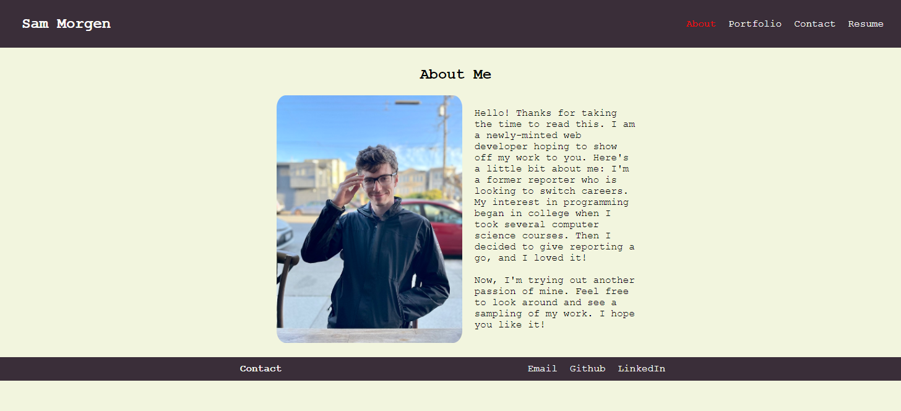

# Portfolio

## Purpose

So you've made it to my React portfolio. That must mean you're interested in my work, which is great. I want to show it off. 

This app is a one-stop shop for all my best work, and the best part is, it is also an example of the great coding I can do. Built from scratch using React, my portfolio shows off my past projects, and allows you go get to know me a little bit.

Take a look around by exploring the codebase. You will find features from React that are used in websites across the world like components and props. I even through a few hooks in there to keep up with the times.

I hope you enjoy my work. I enjoyed making it.

## Built with

- HTML
- CSS
- React

## Website

https://samorgen.github.io/react-portfolio/

## Screenshot

## Contribution

Made by Sam Morgen
